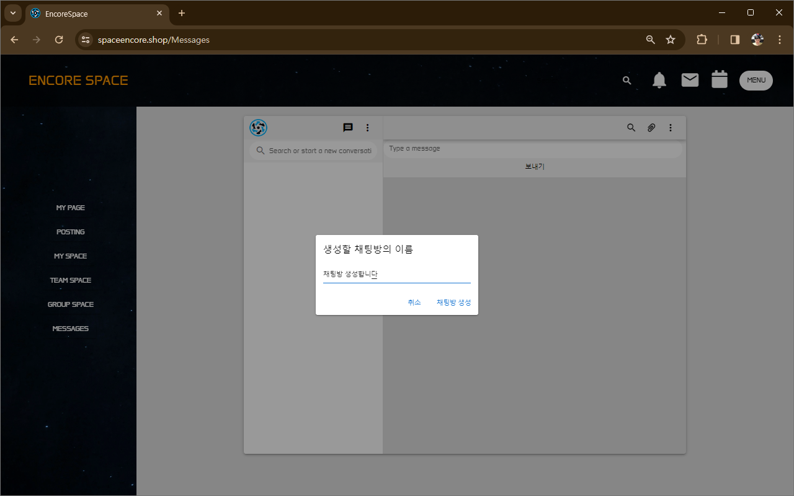

## 로그인 테스트
### - 테스트용 아이디
- 김선국 강사님 ID: ksg3941234@gmail.com / PASS: e123456789
- 설현 매니저님 ID: encorespace@gmail.com / PASS: e123456789

## 로그인이 완료 후 MYPAGE 확인

## 글 작성을 위한 POSTING 이동
#### 글을 작성하기위해서는 스페이스를 생성해야 합니다.

## 게시글을 작성하기 위한 스페이스 생성(MY SPACE 로 이동)
#### GO TO CEREATE 클릭

## 개인스페이스이므로 본인을 선택하고 생성

## 개인 스페이스 입력하고 제출

## MY 스페이스로 이동하여 생성된 스페이스 확인
#### 스페이스를 클릭하면 참여중인 맴버 조회 가능.

## 팀 스페이스로 생성을 위해 TEAM 스페이스로 이동
#### 함께하고 싶은 팀원을 클릭하고 팀 생성

## 팀스페이스를 입력하고 생성

## 팀 스페이스 이동 후 스페이스 조회
#### 팀 생성자는 CAPTAIN , 초대된 사람은 CREW 로 ROLE 이 생김

## 같은 방식으로 그룹 스페이스 생성

## 포스팅으로 이동시 생성한 스페이스가 조회됨

## 작성할 스페이스를 클릭 후 텍스트로만 글 작성 (이미지 첨부시 작성이 안됨)

## 메인 페이지로 리다이렉팅 되고 아래로 내려보면 글이 있음

## 게시글 클릭하면 게시글 상세보기 나옴

## 게시글에 댓글 작성가능

## LIKE(좋아요)를 누르면 우측상단 HEART가 1 증가함 (1번만 가능)

## CANCLE(싫어요)를 누르면 우측 상단의 HEART가 0이됨
#### 댓글에 댓글, LIKE, CANCLE 은 작동하지 않음.

### 댓글은 여러개 작성 가능

## 마이 스페이스로가서 스페이스 클릭하면 작성한 글 조회 가능

## MESSAGES 메뉴로 이동

## 가운데쯤 메시지 모양의 버튼 클릭하면 채팅방 생성됨.

## (F5) 새로고침을 누르면 채팅방이 보입니다.

## 메시지 발송은 배포후 웹소켓 문제로 작동하지 않음

## 마지막으로 로그아웃하고 종료

## 감사합니다.

[spaceencore.shop](spaceencore.shop)
